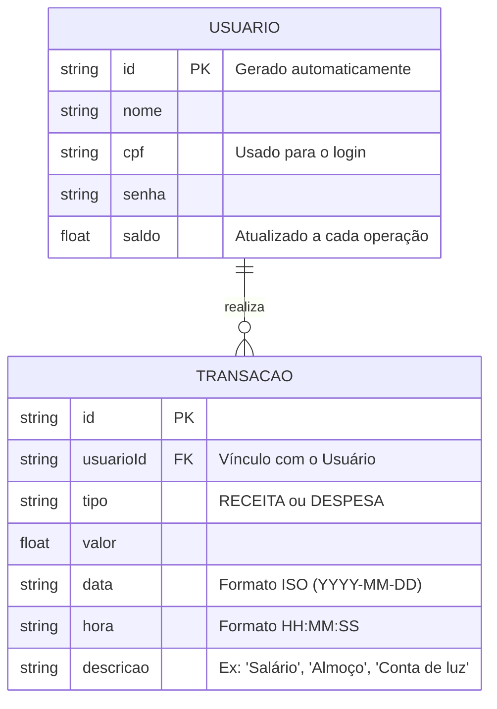

# 🛠️ Especificação Técnica (Tech Spec) - SpendWise

Este documento detalha a arquitetura técnica, o modelo de dados e os contratos de API (via JSON Server) necessários para o funcionamento do sistema de gerenciamento de finanças pessoais SpendWise.

## 1. Modelo de Dados (Diagrama ER)

Abaixo está o Diagrama Entidade-Relacionamento (DER) que representa a estrutura do nosso "banco de dados" (`db.json`) e como as informações se conectam.



## 2. Dicionário de Dados

Breve explicação das tabelas principais:

- **Usuários:** Responsável por armazenar os dados de autenticação e o saldo consolidado do usuário.
  - id: Identificador único gerado pelo JSON Server (String ou Hash).
  - nome: Nome completo do usuário para exibição no painel.
  - cpf: Chave de acesso do usuário durante o login. Para o MVP, validação no front-end é suficiente.
  - senha: Credencial de autenticação (em produção, seria criptografada).
  - saldo: Valor numérico (Float) que representa o saldo total da conta. Calculado como: Receitas - Despesas.

- **Transações:** Registra o histórico financeiro completo (receitas e despesas).
  - id: Identificador único da transação (gerado pelo JSON Server).
  - usuarioId: Chave estrangeira que vincula a transação ao usuário (padrão de nomenclatura para rotas aninhadas do JSON Server).
  - tipo: Aceita apenas os valores "RECEITA" ou "DESPESA".
  - valor: Sempre um número positivo. O front-end decide se soma (RECEITA) ou subtrai (DESPESA) do saldo total baseado no tipo.
  - data: Data da transação em formato ISO (YYYY-MM-DD).
  - hora: Hora da transação em formato HH:MM:SS.
  - descricao: Descrição textual da transação para melhor identificação pelo usuário.

## 3. Rotas da API (JSON Server)

A aplicação consome a API local simulada pelo JSON Server. Abaixo os principais endpoints:

### Usuários
- `GET /usuarios` - Retorna a lista de todos os usuários.
- `POST /usuarios` - Cadastra um novo usuário.
- `GET /usuarios/{id}` - Retorna dados de um usuário específico.
- `PATCH /usuarios/{id}` - Atualiza o saldo de um usuário.

### Transações
- `GET /usuarios/{usuarioId}/transacoes` - Retorna todas as transações de um usuário.
- `POST /usuarios/{usuarioId}/transacoes` - Registra uma nova transação (receita ou despesa).
- `DELETE /usuarios/{usuarioId}/transacoes/{id}` - Remove uma transação (opcional, para correção).

## 4. Estrutura do Banco de Dados (db.json)

Esta é a representação em formato JSON do banco de dados simulado. Esta estrutura serve de contexto para ferramentas de IA e para o JSON Server inicializar a API Fake.

```json
{
  "usuarios": [
    {
      "id": "1",
      "nome": "Guilherme Bondezan",
      "cpf": "12345678900",
      "senha": "senha_segura_123",
      "saldo": 2450.75
    },
    {
      "id": "2",
      "nome": "Maria Silva",
      "cpf": "98765432100",
      "senha": "minha_senha_456",
      "saldo": 1200.50
    }
  ],
  "transacoes": [
    {
      "id": "1",
      "usuarioId": "1",
      "tipo": "RECEITA",
      "valor": 3000.00,
      "data": "2026-03-01",
      "hora": "09:30:00",
      "descricao": "Salário mensal"
    },
    {
      "id": "2",
      "usuarioId": "1",
      "tipo": "DESPESA",
      "valor": 150.00,
      "data": "2026-03-02",
      "hora": "14:15:00",
      "descricao": "Conta de eletricidade"
    },
    {
      "id": "3",
      "usuarioId": "1",
      "tipo": "DESPESA",
      "valor": 85.50,
      "data": "2026-03-03",
      "hora": "12:45:00",
      "descricao": "Almoço com colegas"
    },
    {
      "id": "4",
      "usuarioId": "1",
      "tipo": "RECEITA",
      "valor": 150.00,
      "data": "2026-03-05",
      "hora": "10:00:00",
      "descricao": "Trabalho freelance"
    },
    {
      "id": "5",
      "usuarioId": "1",
      "tipo": "DESPESA",
      "valor": 450.00,
      "data": "2026-03-06",
      "hora": "15:30:00",
      "descricao": "Aluguel"
    },
    {
      "id": "6",
      "usuarioId": "2",
      "tipo": "RECEITA",
      "valor": 2000.00,
      "data": "2026-03-01",
      "hora": "08:00:00",
      "descricao": "Salário mensal"
    },
    {
      "id": "7",
      "usuarioId": "2",
      "tipo": "DESPESA",
      "valor": 500.00,
      "data": "2026-03-02",
      "hora": "11:20:00",
      "descricao": "Supermercado"
    }
  ]
}
```

## 5. Fluxo de Cálculo de Saldo

O saldo do usuário é calculado dinamicamente da seguinte forma:

```
Saldo Total = Σ(Receitas) - Σ(Despesas)
```

**Exemplo com dados da db.json:**
- Receitas do Usuário 1: R$ 3.000,00 + R$ 150,00 = R$ 3.150,00
- Despesas do Usuário 1: R$ 150,00 + R$ 85,50 + R$ 450,00 = R$ 685,50
- **Saldo: R$ 3.150,00 - R$ 685,50 = R$ 2.464,50**

*Nota:* O valor de saldo no objeto usuário deve ser atualizado/sincronizado com este cálculo após cada transação.

## 6. Tecnologias e Dependências

- **Frontend:** HTML5, CSS3 (ou Sass), JavaScript (vanilla ou com jQuery)
- **API Fake:** JSON Server (Node.js)
- **Persistência:** localStorage (front-end) ou JSON Server (back-end simulado)
- **Framework CSS:** Bootstrap v5.3.3
- **API Pública:** AwesomeAPI - API de Cotações de Moedas (v1)
- **Validação:** Regex para CPF, campos obrigatórios em formulários

## 7. Fluxo de Autenticação

1. Usuário preenche CPF e Senha na tela de Login.
2. Front-end faz `GET /usuarios` e filtra pelos dados fornecidos.
3. Se encontrado e a senha corresponde, a sessão é ativada (localStorage + sessionStorage).
4. Usuário redireciona para o Dashboard.

## 8. Fluxo de Registro de Transação

1. Usuário preenche formulário com: Valor, Tipo (Receita/Despesa), Descrição.
2. Front-end valida os dados (valor > 0, descrição preenchida).
3. Front-end faz `POST /usuarios/{usuarioId}/transacoes` com os dados da transação.
4. JSON Server cria a transação com id único e a retorna.
5. Front-end atualiza o saldo do usuário (`PATCH /usuarios/{id}`) com o novo cálculo.
6. Dashboard é recarregado ou atualizado via JavaScript com os novos dados.
7. Mensagem de sucesso é exibida ao usuário.

## 9. Tratamento de Erros

- Validação de CPF com regex.
- Verificação de saldo insuficiente antes de registrar despesa (opcional, conforme regra de negócio).
- Tratamento de requisições falhadas (timeouts, erros 500, etc.) com mensagens amigáveis.
- Validação de campos obrigatórios em formulários.